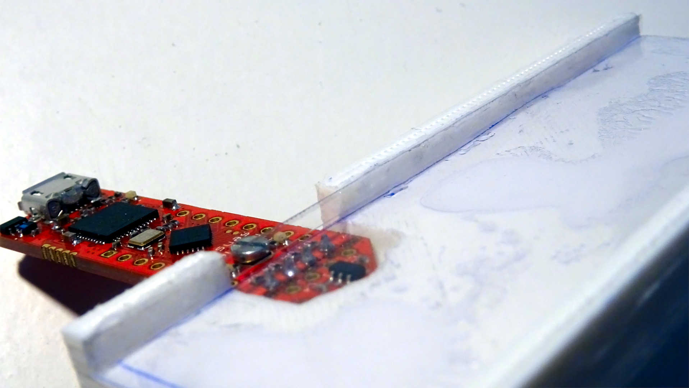
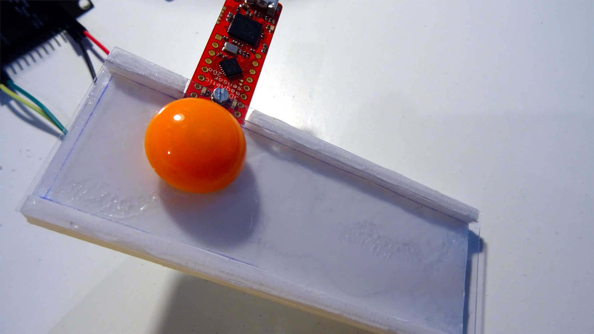
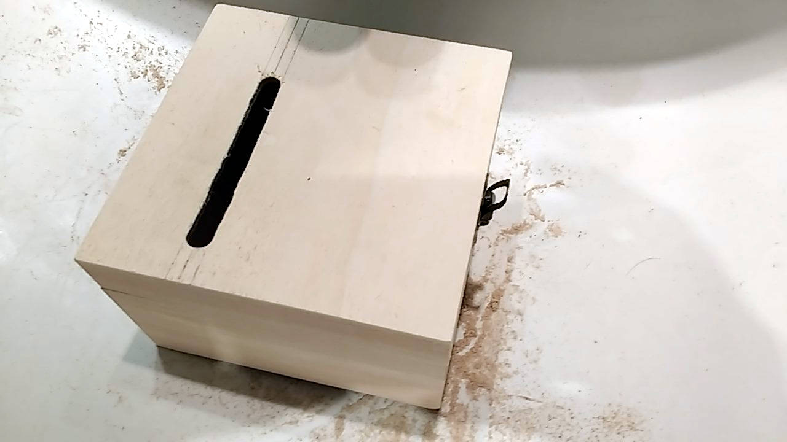
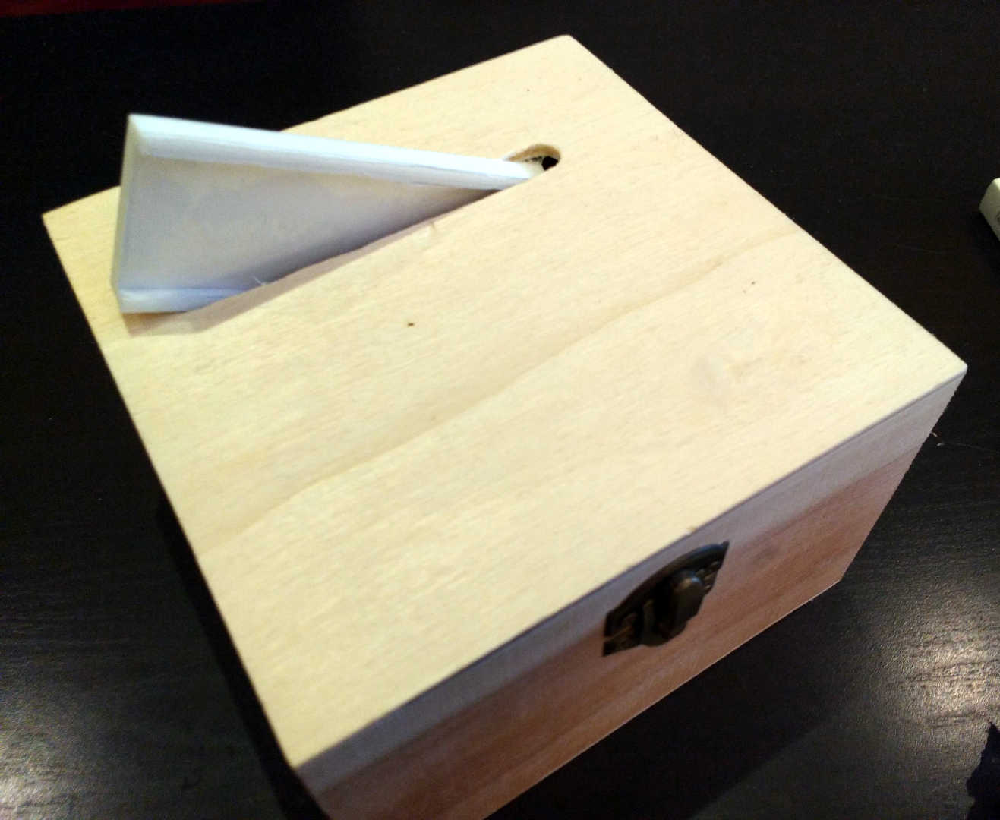
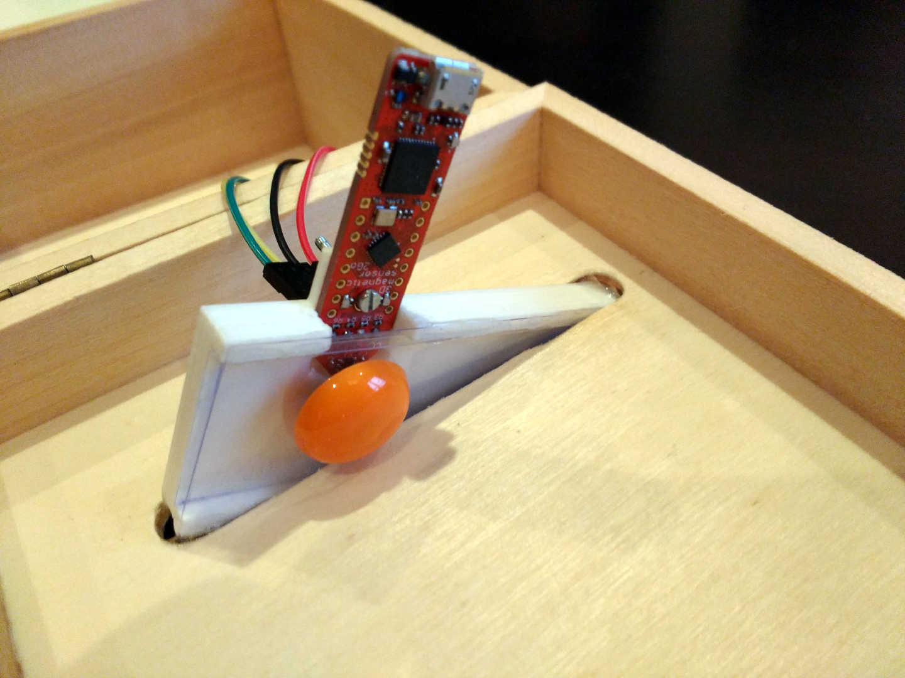
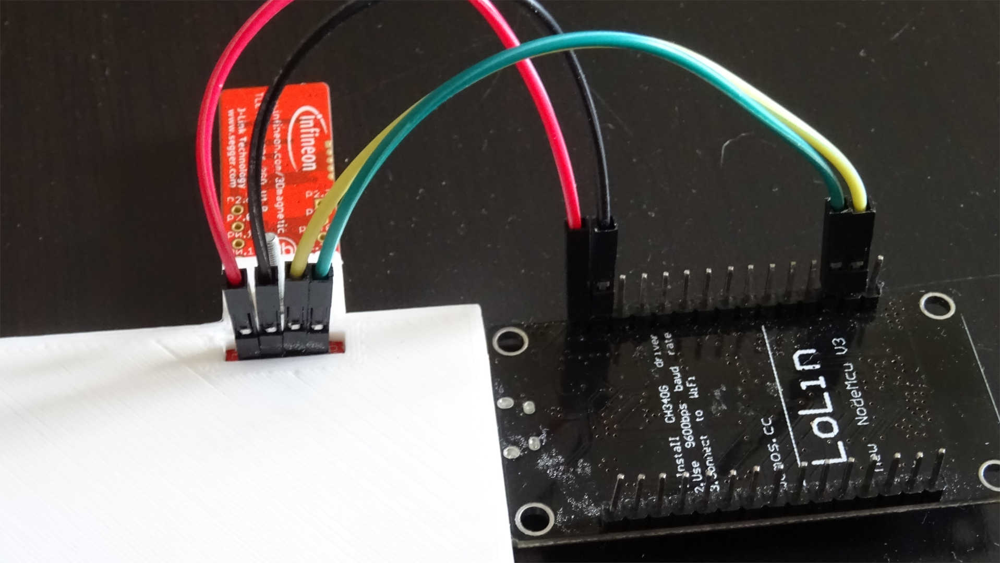

.. index:: build

*****
Build
*****

.. index:: ramp

Ramp
====

Coink is actually very easy to build. First we need the ramp to insert the
coins. The ramp is a 3D design that can be very easily printed with any FDM 3D
printer (or any other more-advance 3D printer if you have access to it).

.. raw:: html

   

     <iframe src="https://render.githubusercontent.com/view/solid?commit=324cbe2c9197e2c0367bea7c304ffcd36a326f1e&enc_url=68747470733a2f2f7261772e67697468756275736572636f6e74656e742e636f6d2f436f6a6f436f6d70616e792f636f696e6b2f333234636265326339313937653263303336376265613763333034666663643336613332366631652f33642f72616d702e73746c&nwo=CojoCompany%2Fcoink&path=3d%2Framp.stl&repository_id=135504662&repository_type=Repository#59ec2a75-53a0-4c74-af08-70542d5da6d9" width="100%" style="position: absolute; top: 0; left: 0; width: 100%; height: 100%">
     </iframe>
   

The 3D design is very simple but, in turn, we need to do some work before using
it. First, we need to glue some plastic sheets to cover the inner parts of the
ramp. This way we avoid the coin bumping into any disturbances around the
sensor board, where the ramp is not continuous:

   Plastic sheets covering the inner parts of the ramp.

Then we need to cover the outter part of the ramp by glueing another plastic
sheet. We will glue our magnet (in orange) there, just in front of the sensor
board. Any magnet will do, we just need to make sure it is not too powerful, or
the coins will get stuck in the ramp!

   Plastic sheet covering the outter part of the ramp and magnet attached to
   it.

.. index:: box

Box
===

The piggy bank can be made with a small wooden box. Wood is easy to work with,
which is important as we will need to create a hole for the ramp in the box:

   Wooden box with a hole for the ramp.

Once we have the hole, we can very easily glue the ramp to the box with some
epoxy to make sure it does not move.

   Ramp glued to the box.

Even if obvious, we should make sure the magnet and the magnetic sensor board
both fit inside the box before glueing the ramp!

   Detail of the ramp inside the box.

.. index:: wiring

Wiring
======

Wiring the magnetic sensor board and the NodeMCU boils down to connect only 4 wires:

===========  ===================
NodeMCU pin  Magnetic sensor pin
===========  ===================
D1 (GPIO5)   SDA (P2.10)
D2 (GPIO4)   SCL (P2.11)
3V3          3V3 (P1.0)
GND          GND
===========  ===================

   NodeMCU and magnetic sensor wiring.
