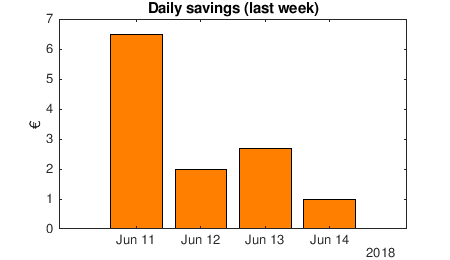
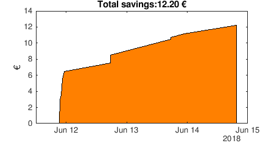

.. index:: cloud

*****************
Cloud integration
*****************

.. index:: thingspeak

Thingspeak
==========

Integrating Coink with an external cloud service like Thingspeak is very
straight forward thanks to their public RESTful API. We just need to write a
couple of lines of code to process and visualize the data appropriately.

The following code snippet plots the daily savings in the last couple of days:

.. code:: matlab

   [data, time] = thingSpeakRead(516536, 'Fields', [1], 'NumDays', 7);
   data = timetable(time, data)
   data = retime(data, 'daily', 'sum')
   bar(data.time, data.Variables, 'FaceColor', [1 .5 0])

The following code snippet plots the total accumulated savings:

.. code:: matlab

   [data, time] = thingSpeakRead(516536, 'Fields', [1], 'NumDays', 365);
   curve = cumsum(data);
   area(time, curve, 'FaceColor', [1 .5 0]);
   title(strcat('Total savings: ', num2str(sum(data), '%.2f'), ' €'));
   ylabel('€');

Note that the code above assumes that the Thingspeak channel was created to
ingest a single field, which corresponds to the coin that was detected on
insertion. The code then sums by day or calculates the total cumulated sum.
