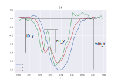

.. index:: data

****
Data
****

.. index:: visualization

Visualization
=============

If we visualize the sensor readings during one second, when a coin is passing
by, we note that there is little time (around 50 milliseconds) to get useful
data:

.. plot::
   :align: center
   :context:

   from analysis import read_data
   from matplotlib import pyplot

   pyplot.style.use('seaborn')

   read_data('../../data/1-0.csv')[:1].plot()

Each of the axis has a different iddle-state reading, so we can normalize the
readings by first dividing by the average iddle-state reading and then
substracting 1 to have an iddle-state reading of 0 in all axis and also to have
data curves that represent relative variations of the magnetic field instead of
absolute.

After doing this normalization we can visualize our region of interest for both
1 € and 2 € coins:

.. plot::
   :align: center
   :context: close-figs

   from analysis import load_data

   c1 = load_data(1, path='../../data')
   c2 = load_data(2, path='../../data')
   c1[0].plot(title='1 €')
   c2[0].plot(title='2 €')

.. index:: differences

Differences
===========

Having a look at the previous curves we might notice some differences between
the 1 € and 2 € curves. Among them we might notice a small difference in the
time span. Although that makes sense (the 2 € coin has a bigger diameter than
the 1 € coin) and we would expect it to alter the magnetic field for a longer
period, this is assuming the speed is the same for both coins. That, of course,
is not very reliable, as we could simply insert coins with higher speed when
pushing them down the ramp. Therefore, we will ignore differences in the x-axis
(time) and focus on the y-axis (magnetic field relative variations).

In order to be able to compare curves and try to differenciate among different
coins, we did some simple feature engineering to try to extract some curve
features that are relevant and easy to compare/match against known profiles:

   Engineered features.

min_[axis]
  Represents the absolute minimum value, for the given axis.

d0_[axis]
  Represents the maximum positive increase since the last rolling minimum from
  the iddle state and until the absolute minimum is reached, for the given
  axis.

l0_[axis]
  Represents the low value where ``d0_[axis]`` started, for the given axis.

Although the differences for those engineered features might seem obvious for
the curves shown above, we want to make sure that the differences are
significant on average for all the data we gathered.

To visualize these differences we can use box plots for all ``min``, ``l0`` and
``d0`` features, for all axis as well:

.. plot::
   :align: center
   :context: close-figs

   from analysis import compare_d0
   from analysis import compare_l0
   from analysis import compare_min
   from analysis import data_features

   df = data_features(c1, c2)
   compare_min(df)
   compare_d0(df)
   compare_l0(df)

We can see there are many significant differences between the two coins.
Although we could use only the most significant among them it is better to
simply use all features. Matching against the average plus some expected
deviation we can not only differenciate between 1 € and 2 € coins, but also
detect unexpected (potentially fake coins) readings.
