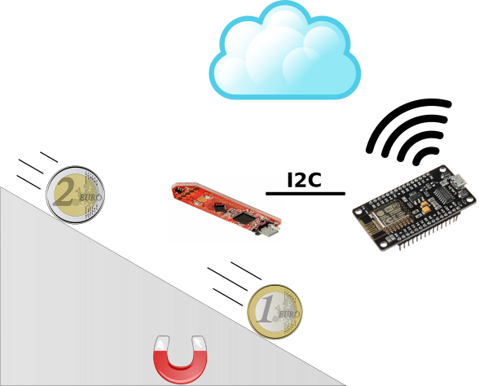

.. index:: introduction

************
Introduction
************

.. index:: abstract

What is Coink?
--------------

Coink is an IoT piggy bank.

In the 21st Century piggy banks can be very easily connected to the cloud and
become part of the rapidly growing Internet of Things.

Having automatic reports of your savings online is not only very convenient but
can also make saving fun for kids! With Coink you can have real-time graphics
with your cumulative savings as well as the recent daily savings to track your
progress.

Adults may use it as well, not only for fun, but to help them quit smoking, for
example, keeping track of the money they save each day. Or in bars and
restaurants, to keep track of the tips they get each day.

Of course the magnetic coin detection system can be used elsewhere: in vending
machines, arcade game machines... The cloud-connected piggy bank is just an
application.

.. index:: materials

What do we need?
----------------

In order to build Coink, we will need:

- A wooden box.
- A `3D-printed ramp`_.
- A magnet attached to the ramp, that generates a static magnetic field.
- A `3D Magnetic Sensor 2GO`_ board from Infineon, that will detect the changes
  on the magnetic field when a coin passes through the ramp and in between the
  magnet and the sensor.
- An ESP8266-based board, in particular a `NodeMCU development kit`_, that
  reads the data from the 3D magnetic sensor through I2C and sends it through
  WiFi to the cloud.
- A `cloud server`_ that analyzes the raw data and identifies the
  different coins.

   Coink project overview

References
==========

.. target-notes::

.. _`3D-printed ramp`:
   https://github.com/CojoCompany/coink/blob/master/3d/ramp.stl
.. _`3D Magnetic Sensor 2GO`:
   https://www.infineon.com/cms/en/product/sensor/magnetic-position-sensor/3d-magnetic-sensor/tle493d-a2b6-ms2go/
.. _`NodeMCU development kit`:
   https://github.com/nodemcu/nodemcu-devkit-v1.0
.. _`cloud server`:
   https://github.com/CojoCompany/coink
