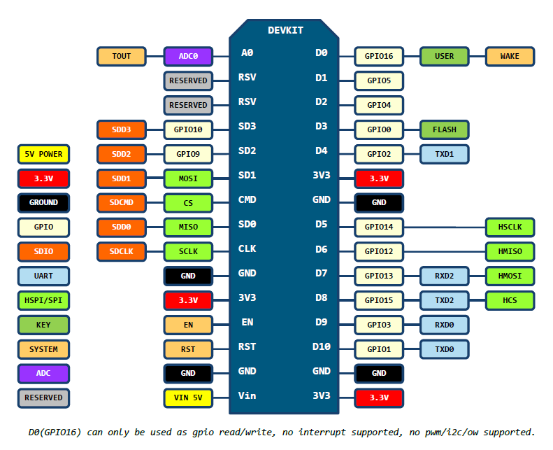
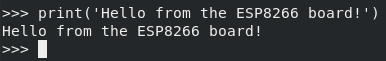

.. index:: setup

*****
Setup
*****

.. index:: board

Board
=====

We use an ESP8266-based board, in particular a `NodeMCU development kit`_.

.. figure:: figures/nodemcu_devkit_v1.0.jpg
   :width: 70%
   :align: center

   NodeMCU development kit.

It is a very cheap, but powerful board.

   NodeMCU development kit pinout.

.. index:: micropython

MicroPython
===========

We use the Python programming language or, more accurately, the `MicroPython`_
programming language. Not only it is a beautiful language, but also implements
an HTTP stack that will ease the process of communicating with a remote server
in any IoT project.

In order to start using MicroPython, we need to `load the MicroPython firmware
onto the ESP8266 board
<https://docs.micropython.org/en/latest/esp8266/esp8266/tutorial/intro.html>`_
first.

Flashing the firmware
---------------------

We need to make sure we have the required permissions to flash the device.
Either::

   sudo usermod -a -G dialout $USER

Or, to avoid the need to log out of your session::

   sudo echo 'ATTRS{idVendor}=="1a86", ATTRS{idProduct}=="7523", MODE="0666"'> /etc/udev/rules.d/99-nodemcu.rules
   sudo udevadm control --reload-rules

.. note:: You might need to adjust the ``idVendor`` and ``idProduct`` depending
   on what you see with ``dmesg`` when connecting the device.

We use `esptool`_ to reflash the device, which is very easy to install with::

   pip install --user esptool

Then, reconnect the device and erase its flash memory with::

   esptool.py --port /dev/ttyUSB0 erase_flash

Download the `latest MicroPython firmware for ESP8266 boards
<https://micropython.org/download#esp8266>`_ and flash it with::

   esptool.py --port /dev/ttyUSB0 --baud 460800 write_flash --flash_size=detect 0 esp8266-20180511-v1.9.4.bin

Testing the REPL
----------------

Once the MicroPython firmware is on the device we can access the REPL (Python
prompt) over serial with a 115000 baudrate::

   screen /dev/ttyUSB0 115200

If everything went well we should see a ``>>>`` (if not, try to press "enter").
You may now try to execute a simple ``print()`` call, which will be executed in
the board itself:

   MicroPython REPL.

.. index:: sensor

Sensor
======

The ESP8266 board is connected to the sensor through an I2C bus, in particular,
using D1 (GPIO5) for the clock and D2 (GPIO4) for the data transmission. The
sensor is powered with the ESP8266 board directly, using its 3V3 and GND pins.

Once the sensor is connected to the board we can check the I2C connection by
simply:

.. code:: python

   from machine import I2C
   from machine import Pin

   i2c = I2C(scl=Pin(5), sda=Pin(4), freq=400000)
   devices = i2c.scan()
   print(devices)

Which should print a non-empty list.

References
==========

.. target-notes::

.. _`esptool`:
   https://github.com/espressif/esptool/
.. _`MicroPython`:
   https://docs.micropython.org/
.. _`NodeMCU development kit`:
   https://github.com/nodemcu/nodemcu-devkit-v1.0
